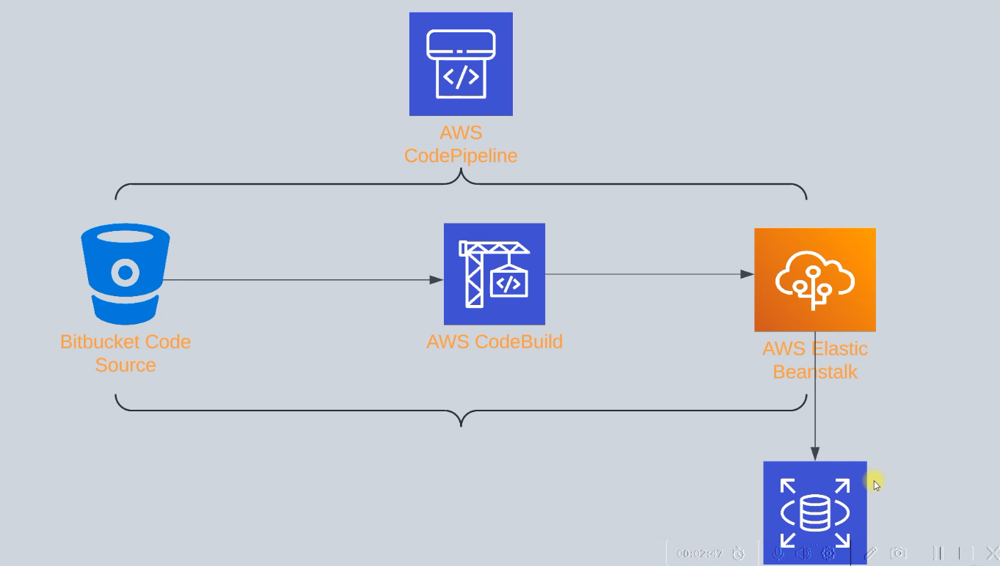
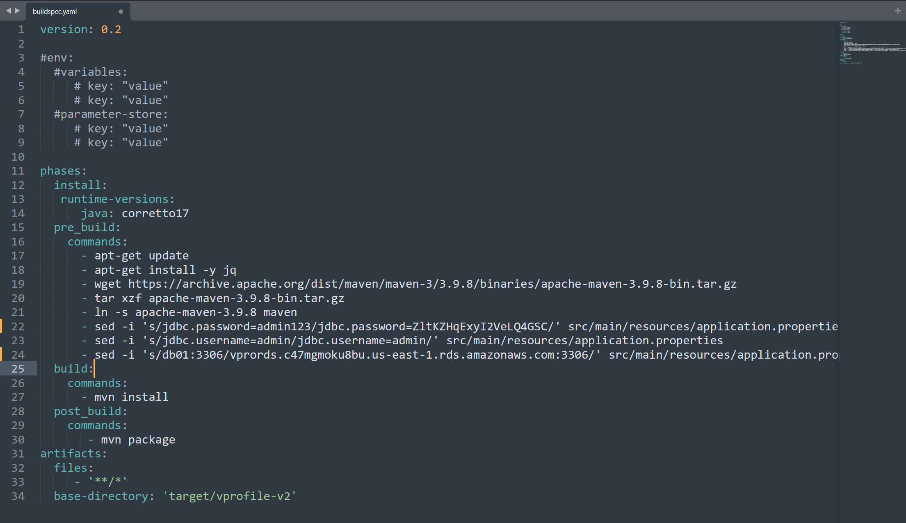
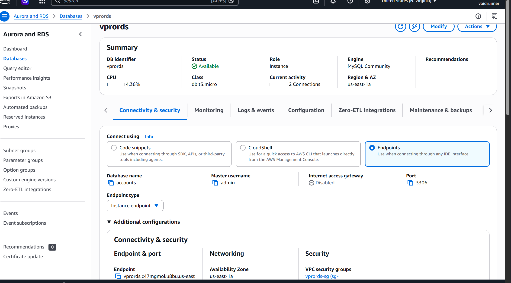
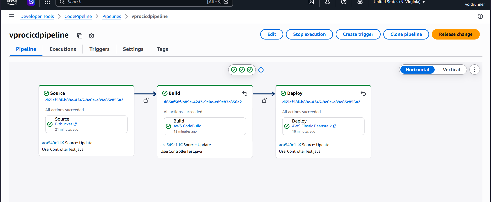

# 🚀 End-to-End AWS CI/CD Pipeline for VProfile Application


---

## 📖 Project Overview

This project demonstrates an **end-to-end Continuous Integration and Continuous Deployment (CI/CD) pipeline on AWS** for the open-source **VProfile Java application**.

The objective was to automate the complete software delivery lifecycle—from source code management to deployment—using fully managed AWS services.

The pipeline automatically:

- Detects source code changes in Bitbucket
- Builds the Java application using AWS CodeBuild
- Generates a deployable WAR artifact
- Stores the artifact in Amazon S3
- Deploys the application to AWS Elastic Beanstalk
- Connects the deployed application with an Amazon RDS MySQL database

This project helped me understand how modern DevOps teams automate software delivery while following cloud-native deployment practices.

---

## 🏗 Architecture

<p align="center">

</p>


### Architecture Flow

```
Developer
      │
      ▼
Bitbucket Repository
      │
      ▼
AWS CodePipeline
      │
      ▼
AWS CodeBuild
      │
Build WAR Artifact
      │
      ▼
Amazon S3
      │
      ▼
Elastic Beanstalk
      │
      ▼
Application running on EC2
      │
      ▼
Amazon RDS (MySQL)
```

---

## ☁️ AWS Services Used

| Service | Purpose |
|----------|----------|
| Bitbucket | Source Code Repository |
| AWS CodePipeline | CI/CD Pipeline Orchestration |
| AWS CodeBuild | Build Automation |
| Amazon S3 | Artifact Storage |
| Elastic Beanstalk | Application Deployment |
| Amazon EC2 | Application Hosting |
| Auto Scaling Group | High Availability |
| Application Load Balancer | Traffic Distribution |
| Amazon RDS (MySQL) | Database |
| IAM | Roles & Permissions |
| CloudWatch | Build Logs & Monitoring |

---

# 🔄 CI/CD Workflow

```
Developer
     │
git push
     │
     ▼
Bitbucket
     │
     ▼
AWS CodePipeline
     │
     ▼
AWS CodeBuild
     │
     ▼
Build WAR Artifact
     │
     ▼
Amazon S3
     │
     ▼
Elastic Beanstalk
     │
     ▼
Application Running
     │
     ▼
Amazon RDS
```

---

# 📂 Source Stage – Bitbucket Repository

The VProfile application source code was migrated from GitHub to a Bitbucket repository. Bitbucket acts as the source provider for AWS CodePipeline.

Every new commit pushed to the repository automatically triggers the CI/CD pipeline.

### Screenshot

<p align="center">

</p>

---

# ⚙ Build Stage – AWS CodeBuild

AWS CodeBuild acts as the Continuous Integration (CI) service.

It performs the following tasks:

- Downloads source code from Bitbucket
- Reads the `buildspec.yml` file
- Installs project dependencies
- Compiles the Java application using Maven
- Generates a deployable WAR artifact
- Uploads the artifact to Amazon S3

### Build Specification

<p align="center">

</p>

The project uses a `buildspec.yml` file to define each build phase:

- Install
- Pre-build
- Build
- Post-build

### CodeBuild Project

<p align="center">

</p>

### Successful Build History

<p align="center">

</p>

---

# 📦 Artifact Storage – Amazon S3

After a successful build, AWS CodeBuild stores the generated deployment artifact in an Amazon S3 bucket.

AWS CodePipeline retrieves this artifact during the deployment stage and passes it to Elastic Beanstalk.

### Screenshot

<p align="center">

</p>

---

# 🚀 Deployment Stage – AWS Elastic Beanstalk

AWS Elastic Beanstalk provides a managed deployment platform for the Java application.

Instead of manually provisioning EC2 instances and configuring Tomcat, Elastic Beanstalk automates:

- EC2 provisioning
- Application deployment
- Health monitoring
- Auto Scaling
- Load Balancer integration
- Rolling deployments

The deployment policy was configured as **Rolling Deployment** with a **50% batch size**, allowing one EC2 instance to be updated while the other continues serving user traffic.

### Elastic Beanstalk Environment

<p align="center">

</p>

### Running Application

<p align="center">

</p>

---

# 🗄 Database Layer – Amazon RDS

The application stores its persistent data in an Amazon RDS MySQL database.

The database schema was initialized using SQL scripts from the VProfile project, creating the required tables before deployment.

Database Tables:

- user
- role
- user_role

### Amazon RDS

<p align="center">

</p>

### Database Verification

<p align="center">

</p>

---

# ⚖ Load Balancer

An **Application Load Balancer (ALB)** was automatically provisioned by Elastic Beanstalk to distribute incoming traffic across multiple EC2 instances.

Benefits:

- High Availability
- Traffic Distribution
- Health Checks
- Supports Rolling Deployments

### Screenshot

<p align="center">

</p>

---

# 📈 Auto Scaling

Elastic Beanstalk automatically created an Auto Scaling Group for the application.

Configuration used:

- Deployment Policy: **Rolling**
- Batch Size: **50%**
- Running Instances: **2**

This configuration ensures that one instance remains available while the other is updated, reducing application downtime during deployments.

### Screenshot

<p align="center">

</p>

---

# 💻 EC2 Instances

Elastic Beanstalk provisions and manages the EC2 instances that host the application.

The instances run:

- Java Runtime
- Apache Tomcat
- VProfile Application

Developers don't have to manually configure or manage the infrastructure.

### Screenshot

<p align="center">

</p>

---

# 🔄 AWS CodePipeline

AWS CodePipeline orchestrates the complete CI/CD workflow.

Whenever new code is pushed to the Bitbucket repository, the pipeline automatically executes the following stages:

1. Source (Bitbucket)
2. Build (AWS CodeBuild)
3. Deploy (Elastic Beanstalk)

This eliminates manual deployments and provides a repeatable deployment process.

### Pipeline Execution

<p align="center">

</p>

---

# 📁 Repository Structure

```
aws-cicd-vprofile
│
├── README.md
├── architecture
│   └── architecture.png
│
├── screenshots
│   ├── application.png
│   ├── autoscaling.png
│   ├── beanstalk.png
│   ├── bitbucket.png
│   ├── build-history.png
│   ├── buildspec.png
│   ├── codebuild.png
│   ├── codepipeline.png
│   ├── database-tables.png
│   ├── ec2.png
│   ├── loadbalancer.png
│   ├── rds.png
│   └── s3.png
│
└── buildspec.yml
```

---

# 🎯 Skills Demonstrated

- AWS CodePipeline
- AWS CodeBuild
- AWS Elastic Beanstalk
- Amazon RDS (MySQL)
- Amazon S3
- Amazon EC2
- Application Load Balancer
- Auto Scaling Groups
- IAM Roles & Policies
- CloudWatch Logs
- Bitbucket
- Git
- Maven
- Java Web Application Deployment
- Continuous Integration (CI)
- Continuous Deployment (CD)

---

# 📚 Key Learnings

During this project I gained practical experience with:

- Building an end-to-end CI/CD pipeline using AWS managed services.
- Migrating source code from GitHub to Bitbucket.
- Creating automated build workflows using AWS CodeBuild.
- Writing and understanding `buildspec.yml`.
- Deploying Java applications using Elastic Beanstalk.
- Configuring rolling deployments for minimal downtime.
- Provisioning and connecting an Amazon RDS MySQL database.
- Managing AWS IAM roles and permissions.
- Troubleshooting build failures using CloudWatch Logs.

---

# 🚀 Future Improvements

Possible enhancements for this project include:

- Containerizing the application using Docker.
- Deploying on Amazon ECS or Amazon EKS.
- Provisioning infrastructure using Terraform.
- Storing secrets in AWS Secrets Manager.
- Integrating SonarQube for code quality analysis.
- Adding security scanning with Trivy.
- Implementing Blue/Green deployments.
- Replacing Bitbucket with GitHub Actions for comparison.

---

# 📌 Acknowledgements

The application used in this project is based on the open-source **VProfile** application created by **hkhcoder**.

This repository focuses on documenting and implementing the AWS CI/CD pipeline, cloud infrastructure, and deployment workflow built around that application.

Original Repository:

https://github.com/hkhcoder/vprofile-project

---

# 👨‍💻 Author

**Ishan Chaturvedi**

B.Tech Computer Science Engineering  
Cloud & DevOps Enthusiast

- GitHub: https://github.com/Git-Ishan
- LinkedIn: *(https://www.linkedin.com/in/ishan-chaturvedi-428094283/)*

---

## ⭐ If you found this project useful, consider giving it a star!
